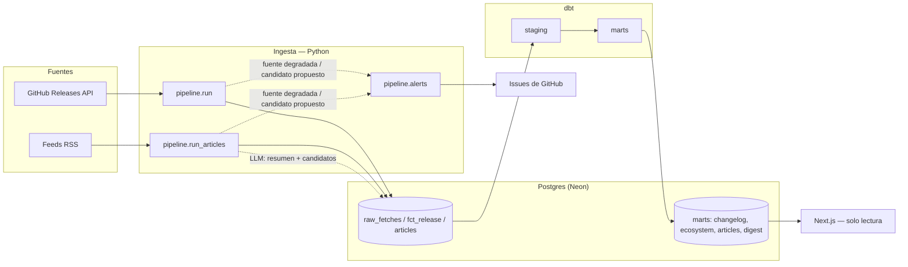

# DE Radar

**El radar del ecosistema de Data Engineering.** Releases, breaking changes y artículos técnicos de las herramientas que un data engineer usa a diario — extraídos de fuentes oficiales, deduplicados, resumidos y traducidos automáticamente. Sin ruido de marketing, sin releases irrelevantes, sin que se te pase un breaking change de Airflow por no estar suscrito al blog correcto.

🔗 **[web-roan-seven-27.vercel.app](https://web-roan-seven-27.vercel.app/)**

[](https://github.com/JeanArdila711/data-engineering/actions/workflows/ingest.yml)

---

## Qué hace

Todos los días, sin intervención humana:

1. **Ingesta** releases de GitHub y artículos de feeds RSS de las herramientas del catálogo.
2. **Deduplica** por clave natural (versión normalizada, o huella de contenido para artículos) — correr el pipeline dos veces no duplica nada.
3. **Extrae** breaking changes de forma determinística (parseo de texto, sin LLM) y **resume** artículos con un LLM cuando el heurístico de relevancia no alcanza — nunca al revés.
4. **Valida** cada resumen contra el cuerpo original antes de aceptarlo (anclaje por cita, no por offset de texto).
5. **Descubre** herramientas nuevas: si un artículo no menciona nada del catálogo, le pregunta al LLM qué herramienta pudo haber mencionado, y si el mismo nombre aparece en 2+ artículos distintos, abre un issue proponiéndolo. Nunca se auto-inserta al catálogo.
6. **Vigila su propia salud**: clasifica fallos de fuente en transitorios vs. permanentes, degrada una fuente tras 3 fallos seguidos, y alerta por issue de GitHub.
7. **Transforma** todo con dbt (`raw → staging → marts`) y revalida el sitio.

El resultado se sirve en cuatro vistas: **Changelog** (línea de tiempo de releases), **Ecosistema** (estado acumulado por herramienta), **Artículos** (deep-dives técnicos, bilingüe EN/ES) y **Digest** (actividad de los últimos 7 días).

## Arquitectura



**Orquestación:** GitHub Actions, cron diario — no Airflow. Con 10 herramientas y una corrida de minutos, un orquestador dedicado es infraestructura sin problema que resolver; la decisión está documentada, no es ausencia de criterio.

**Por qué Postgres directo y no un warehouse columnar:** el volumen (miles de releases, no millones) no justifica el salto. dbt igual separa `staging`/`marts` para que la lógica de transformación no viva ni en el pipeline de ingesta ni en las queries del frontend.

## Decisiones de diseño que vale la pena señalar

| Decisión | Por qué |
|---|---|
| **Catálogo como dato, no como código** (`catalog/tools.yaml`) | Agregar una herramienta es un PR a un YAML, no un deploy. El pipeline nunca hardcodea qué herramientas existen. |
| **Confianza por capas** | Releases: extracción determinística de texto, cero LLM. Artículos: heurístico de relevancia primero, LLM solo como desempate. El LLM nunca es la única fuente de verdad. |
| **SCD Tipo 2 en `dim_tool`** | Una herramienta puede cambiar de categoría sin perder qué categoría tenía cuando salió cada release histórico. |
| **Cuarentena en vez de descarte silencioso** | Un artículo o resumen que no pasa validación se aísla y se loguea, nunca se pierde sin dejar rastro. |
| **Descubrimiento propone, nunca inserta** | El catálogo sigue curado a mano. El pipeline solo abre un issue cuando un nombre no catalogado aparece 2+ veces. |
| **Idempotencia como eje central** | Cada tabla de conteo/mención usa una clave de unicidad real (`UNIQUE(candidate_id, article_url)`), nunca un contador que se incrementa — reprocesar el mismo dato nunca infla nada. |
| **Tests contra Postgres real, no mocks** | `tests/conftest.py` levanta un schema real y corre las migraciones reales en cada test. Los bugs de integración (JSON inválido de Gemini, un feed dado de baja) solo aparecen así. |
| **Versión mostrada ≠ versión de dedup** | `fct_release` guarda el tag crudo (`raw_version`) además del semver normalizado — una herramienta que no usa semver (Trino tagea `483`, no `483.0.0`) se muestra tal cual la fuente la publicó, no forzada a una forma que miente. |

## Stack

| Capa | Tecnología |
|---|---|
| Ingesta (E+L) | Python 3.12, psycopg3, Pydantic, `uv` |
| LLM | Gemini (`google-genai`) — resumen anclado, traducción, descubrimiento |
| Transformación (T) | dbt-core 1.12.3 (`raw → staging → marts`) |
| Almacenamiento | Postgres (Neon) |
| Orquestación | GitHub Actions, cron diario |
| Web | Next.js 16, React 19, Tailwind v4, Framer Motion — solo lectura, ISR |

## Correr en local

```bash
uv sync

# .env con: DATABASE_URL, GH_API_TOKEN, GEMINI_API_KEY,
# GEMINI_MODEL_SUMMARY, GEMINI_MODEL_JUDGE, REVALIDATE_SECRET

uv run python -m pipeline.run           # releases (aplica migraciones)
uv run python -m pipeline.run_articles  # artículos
uv run python -m pipeline.alerts        # salud de fuentes + candidatos

cd transform && uv run dbt run && uv run dbt test

cd web && npm install && npm run dev
```

### Tests

```bash
# TEST_DATABASE_URL apuntando a un Postgres real (local o Docker)
uv run pytest -q
```

Sin mocks de base de datos: cada test corre las migraciones reales contra un schema limpio.

## Estructura

```
pipeline/           # ingesta, dedup, scoring, LLM, salud de fuentes
  sources/          # adaptadores GitHub / RSS
transform/          # dbt: staging → marts
migrations/         # DDL versionado, aplicado por el propio pipeline
catalog/tools.yaml  # qué herramientas se rastrean — dato, no código
web/                # Next.js, solo lectura sobre los marts
tests/              # contra Postgres real, sin mocks
.github/workflows/  # cron diario: ingesta → dbt → revalidar → alertas
```

## Estado

Cuatro fases implementadas y desplegadas: changelog de releases, artículos con validación de anclaje y traducción, digest + mapa del ecosistema, y descubrimiento automático + salud de fuentes. Corriendo en producción contra datos reales — 10 herramientas rastreadas, más de mil releases indexados.

---

*Proyecto personal de Jean Carlo Ardila Acevedo — Ingeniería de Sistemas, EAFIT.*
